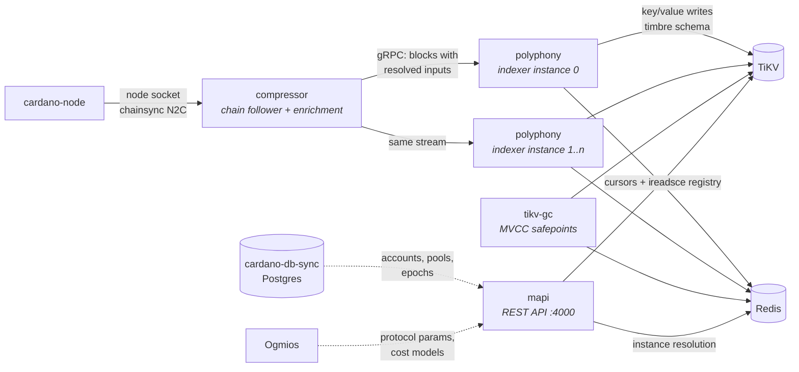

# Maestro Cardano Indexer

[](https://github.com/maestro-org/maestro-cardano-indexer/actions/workflows/ci.yml)
[](./LICENSE)

**A production-scale, distributed Cardano indexing stack** — the system that powered
[Maestro](https://www.gomaestro.org/)'s Cardano API platform, now open source. It
indexes the Cardano chain — every era from Byron to Conway — into TiKV and serves
the results as a documented REST API: addresses, transactions, UTxOs, native
assets, datums, scripts, and (via optional cardano-db-sync and Ogmios backends)
accounts, pools, epochs, protocol parameters, and Plutus script evaluation.

## How the pieces make an indexing stack



A stock **cardano-node** is the source of truth; nothing patches or extends it.

**compressor** follows the node over its socket (Ouroboros chainsync, via
[Pallas](https://github.com/txpipe/pallas)) and solves the problem that makes
UTxO-chain indexing expensive: a raw block doesn't contain the data an indexer
needs, because inputs are only pointers to outputs of older transactions.
Compressor resolves every input to its full previous output — seeding the Byron
genesis UTxOs from the genesis file so resolution is complete from slot zero —
and serves *enriched blocks* over gRPC: paged history for backfills and an
apply/undo stream at the tip. Each resolved output carries its era tag, so
consumers can decode outputs from any era without their own era bookkeeping.
The expensive resolver state is computed **once**, so indexer instances
downstream stay cheap enough to create and discard freely — the property the
whole operational model rests on.

**polyphony** is the indexer — it began as a fork of TxPipe's
[Scrolls](https://github.com/txpipe/scrolls) and has since been substantially
rewritten. It consumes enriched blocks and
folds them through configurable *reducers* into key/value writes, expressed in a
small action DSL that is merged and batched before committing to TiKV. Each
running polyphony is an *instance* whose identity — `(dataplane_id, instance_id)`
— prefixes every key it writes, so many instances (including duplicates of the
same reducers) index in parallel in one cluster without interfering. After every
commit an instance publishes a cursor entry (slot, block hash, TiKV commit
timestamp) to Redis.

**timbre** is a library, not a service: the byte-level schema of every key and
value in the store. polyphony links it to write; mapi links it to read; the two
never talk to each other. Data is the interface.

**mapi** is the stateless REST API. Per request, it resolves *which instance's
data to read* from the Redis instance registry, opens a TiKV snapshot at the
current timestamp, and decodes timbre keys and values into responses — each
stamped with the serving instance's indexed chain position (`last_updated`).
Endpoint groups that need ledger-derived state (accounts, pools, epochs) read
from a cardano-db-sync Postgres, and protocol parameters and Plutus cost models
come from an Ogmios websocket; script evaluation runs in-process via
[uplc](https://github.com/aiken-lang/aiken).

**tikv-gc** makes MVCC retention explicit. TiKV keeps old versions of values
until garbage collection; tikv-gc owns the GC safepoint, advancing it only past
timestamps that *no reader can still need*. Run it often and the store stays
compact; run it rarely and old snapshots stay readable longer. Without it, TiKV
never collects at all.

**TiKV** stores the indexed data (MVCC snapshots, horizontal write scaling,
ordered range scans, prefix multi-tenancy — the four properties the design leans
on). **Redis** is the coordination plane: cursors, the instance registry, GC
bookkeeping. It holds no indexed data and is repopulated by running instances if
lost.

## The components in depth

The full design rationale lives in **[docs/design.md](docs/design.md)** — each
bullet links to its section.

### [compressor](services/compressor) — enrich once, index everywhere

- Maintains the full TXO resolver so that no indexer instance ever has to — the
  marginal cost of another indexer is near zero
  ([design §6](docs/design.md#6-resolve-once-enrich-everywhere)).
- Two gRPC surfaces (`proto/sync/v1`, package `compressor.sync.v1`):
  `PageBlocksWithContext` (bulk backfill) and `StreamUpdatesWithContext` (tip
  stream where rollbacks are explicit apply/undo protocol events).
- Enrichment spans every era: Byron genesis UTxOs are seeded from the genesis
  JSON, and each resolved output carries the era tag needed to decode it
  ([design §3](docs/design.md#3-one-stream-from-byron-to-conway)).
- Has its own rollback machinery: a mutable window (`immutable_after_slots`)
  with a rollback log, so the node's rollbacks rewind the store exactly.
- Serves RocksDB metrics for Prometheus on `:9090`.

### [polyphony](services/polyphony) — the indexer

- Reducers are pure folds from enriched blocks to *actions* (`set`, `delete`,
  `increment`, …). Actions compose algebraically — last-write-wins, set/delete
  cancellation, increment folding — and the storage stage merges them before
  writing, substantially reducing write volume on dense blocks
  ([design §4](docs/design.md#4-the-storage-dsl-actions-as-algebra)).
- Every committed action records its inverse in a **rollback buffer**
  (persisted to TiKV, survives restarts). Rollbacks are handled by applying
  inverses back to the fork point; a rollback deeper than the buffer makes the
  instance *panic rather than serve wrong data*
  ([design §5](docs/design.md#5-rollbacks-the-rollback-buffer-and-refusing-to-be-wrong)).
- Commits run inside an in-memory **two-phase work unit** that re-schedules any
  unit that didn't commit, and an optional `paranoid_mode` reads every mutation
  back after commit and verifies it landed
  ([design §7](docs/design.md#7-committing-safely-work-units-batching-and-paranoid-mode)).
- The **sync batcher** merges the actions of many blocks into one transaction
  during backfill, flushing on a TiKV raft-entry-size threshold — deep history
  commits at a fraction of its raw write volume
  ([design §7](docs/design.md#7-committing-safely-work-units-batching-and-paranoid-mode)).
- Instances only advertise themselves in the registry **once they reach the
  mutable window at the chain tip** — a backfilling instance is invisible by
  construction ([design §1](docs/design.md#1-fixing-a-broken-indexer-with-zero-downtime)).

### [timbre](crates/timbre) — the schema is the index

- One key shape: `<dataplane u8><instance u8> 'D' <reducer tag> <key body>`;
  cursors, rollback entries, and token-registry metadata live in the same
  ordered keyspace under their own plane tags
  ([design §9](docs/design.md#9-the-key-encoding-how-a-keyvalue-store-answers-range-queries)).
- Integers encode big-endian so lexicographic order equals numeric order — a
  byte-range scan *is* a slot-range scan.
- **Field order is the query plan**: e.g. UTxOs-by-address keys are
  `{address, slot, utxo_hash, utxo_index}` — prefix scan per address,
  slot-bounded within. TiKV has no indexes; none are needed.
- Pagination cursors are (suffixes of) the last key returned, base64url-encoded
  — resuming a scan is seeking to a key; no offsets, stable under writes.

### [mapi](services/mapi) — the API layer

- Resolves instances per request from per-reducer Redis sorted sets — "which
  instance serves this reducer" is data, not configuration
  ([design §1](docs/design.md#1-fixing-a-broken-indexer-with-zero-downtime)).
- ~60 documented endpoints across three backends: TiKV for indexed chain data,
  cardano-db-sync Postgres for ledger-derived state, and Ogmios for protocol
  parameters and the cost models behind `/transactions/evaluate` (Plutus
  execution-unit evaluation, run in-process via uplc)
  ([design §8](docs/design.md#8-reading-per-request-instance-resolution)).
- Every TiKV-backed response carries `last_updated` — the exact block the
  serving instance had indexed to, read in the same snapshot as the data.
- The OpenAPI document is committed at
  [`services/mapi/docs/indexer/swagger.json`](services/mapi/docs/indexer/swagger.json)
  and regenerated with the `docs` subcommand.

### [tikv-gc](services/tikv-gc) — retention as a contract

- Advances TiKV's GC safepoint to the newest timestamp that satisfies three
  invariants: every instance's chaintip snapshot stays readable; each network's
  cross-instance common block stays readable; nothing younger than a safe-zone
  window (default 10 min) is ever collected
  ([design §2](docs/design.md#2-one-store-many-instances-mvcc-and-tikv-gc)).
- The operational dial: **how far back old snapshots stay readable equals the
  GC cadence**.

### [daw](services/daw) — admin CLI

- An operator tool (not part of the running pipeline) for inspecting and deleting
  indexer key ranges in TiKV, with helpers that understand the timbre
  key layout. Dry-run by default; `--force` to apply. This is the tooling behind
  the retire-an-instance step of the zero-downtime upgrade flow.

## Quickstart (preprod)

Preprod is the default network: it exercises the full stack with a modest
history. Configs for `preview` and `mainnet` ship in `configs/` (preview's
history is much heavier; mainnet needs serious disk and days of sync).

Requires Docker. First run syncs the preprod network from scratch — allow a few
hours.

```bash
docker compose up -d --build
```

Watch it come to life:

```bash
# compressor sync progress (node vs pull/roll stages)
curl -s localhost:50052/health | jq

# reducers committing to TiKV
docker compose logs -f polyphony-a

# the API
curl -s localhost:4000/healthcheck
```

Once synced, explore (every TiKV-backed response names the block it was served
at, as `last_updated`):

```bash
# the tip and a block
curl -s "localhost:4000/chain-tip" | jq
curl -s "localhost:4000/blocks/latest" | jq

# an address: UTxOs, transactions, balance by payment credential
curl -s "localhost:4000/addresses/<addr>/utxos" | jq
curl -s "localhost:4000/addresses/<addr>/transactions" | jq

# native assets: info, holders, policy-wide queries
curl -s "localhost:4000/assets/<policy+name-hex>" | jq
curl -s "localhost:4000/policy/<policy>/utxos" | jq

# transactions and datums
curl -s "localhost:4000/transactions/<tx_hash>" | jq
curl -s "localhost:4000/datums/<datum_hash>" | jq
```

### The `full` profile: db-sync and Ogmios backends

The core stack serves everything indexed from the enriched block stream. The
endpoint groups that need ledger-derived state — accounts, pools, epochs,
protocol parameters, era summaries, and `/transactions/evaluate` — read from
cardano-db-sync and Ogmios, which the `full` profile adds (both sync from the
same cardano-node):

```bash
docker compose --profile full up -d
```

The profile also installs the [Koios](https://koios.rest) SQL layer these
endpoints query into the db-sync database and keeps its cached tables
refreshed — see [operations](docs/operations.md#db-sync-helper-schema) for the
moving parts. Without the profile those endpoint groups return errors and the
rest of the API works.

### The showcase: parallel instances and swap-over

Start a **second indexer instance** at any time:

```bash
docker compose --profile multi up -d polyphony-b
```

It backfills the whole chain in parallel — invisible to the API — and the moment
it reaches the tip it registers itself and the API starts reading from it.
This is how reducer upgrades ship with zero downtime: no migrations, no locks, no
API restarts.
([design §1](docs/design.md#1-fixing-a-broken-indexer-with-zero-downtime))

### Mainnet

```bash
docker compose -f docker-compose.yml -f docker-compose.mainnet.yml up -d --build
```

Bring disk (cardano-node ~200 GB, and the rolldb/TiKV grow into the hundreds of
GB) and patience (days of initial sync).

## Documentation

- **[docs/design.md](docs/design.md) — the design: architecture, the problems
  and the mechanisms that solve them, and the coordination data model** (start here)
- [docs/reducers.md](docs/reducers.md) — the reducer catalogue and how to write one
- [docs/operations.md](docs/operations.md) — scaling from this compose file to a production topology

## Relationship to maestro-bitcoin-indexer

[maestro-bitcoin-indexer](https://github.com/maestro-org/maestro-bitcoin-indexer)
is this stack's sibling: the same architecture family — compressor enrichment,
polyphony reducers over gasket, timbre key schema, TiKV + Redis, tikv-gc —
applied to Bitcoin. The chains dictate the differences: the Bitcoin stack
additionally indexes the mempool and metaprotocols (runes, ordinals, BRC-20) and
unifies every read onto one cross-reducer snapshot with time-travel queries;
the Cardano stack has no mempool pipeline, serves reads at the current tip
rather than a unified block, and adds cardano-db-sync and Ogmios as auxiliary
backends for ledger-derived state. The two repositories mirror each other's
layout, so anything learned in one transfers to the other.

## Security

mapi has no in-process authentication or rate limiting — put it behind a
gateway before exposing it. The `postgres`/`cexplorer` credentials in the
example compose file are for local development only.

## Acknowledgements

polyphony began as a fork of TxPipe's
[Scrolls](https://github.com/txpipe/scrolls) — since substantially rewritten —
and is built on the
[gasket](https://github.com/construkts/gasket-rs) pipeline framework. Chain
access is built on TxPipe's [Pallas](https://github.com/txpipe/pallas), and
Plutus script evaluation uses [uplc](https://github.com/aiken-lang/aiken) from
the Aiken project (see [NOTICE](NOTICE)).

## License

Apache-2.0. Originally built by the Maestro engineering team. See
[NOTICE](NOTICE) for third-party attributions.
